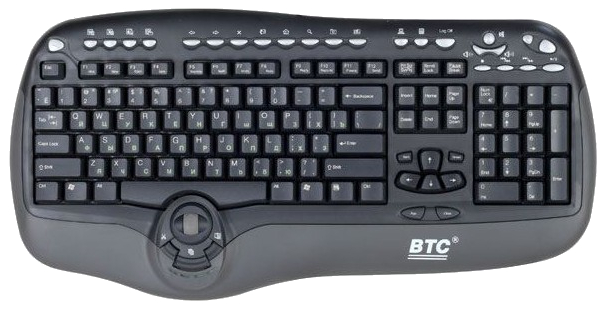

# PS/2 Keyboard BTC Model 8190A

Simple arduino sketch used to convert an old PS/2 keyboard into a fully working USB-C one.

## Libraries
The project used the following libraies:
- [PS2KeyAdvanced](https://github.com/techpaul/PS2KeyAdvanced/tree/master)
- [PS2KeyMap](https://github.com/techpaul/PS2KeyMap)
- [Keyboard](https://www.arduino.cc/reference/en/language/functions/usb/keyboard/)

## Hardware
- [Sparkfun Pro Micro](https://www.sparkfun.com/products/12640)
- PS/2 Keyboard BTC Model 8190A

### Pinout configuration
Wire  | Pin
------ | ---
Red    | 5V Vcc
Yellow | Ground
White  | Data
Green  | Clock
Black  | ???

> **Note:** In order to guarantee the correct current flow to the keyboard without heaving on the Arduino itself, I connect the keyboard Vcc wire to the Arduino `RAW` pin (directly connected to the USB). Eventually, I also bridged the J1 pin to be sure that al the board works at 5 volt.
