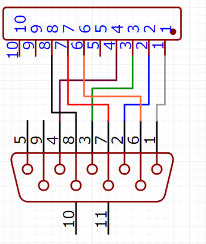
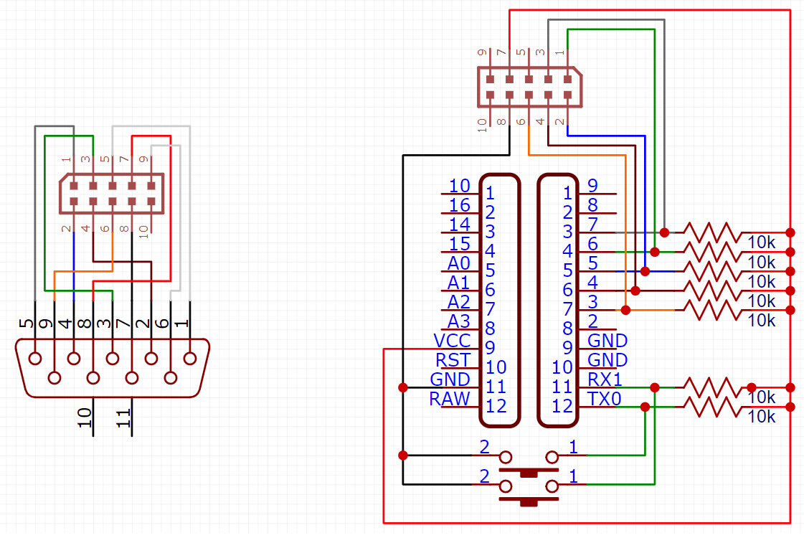

# Commodore 64 Games System Controller (1990)
For additional information the console, look on [Wikipedia](https://en.wikipedia.org/wiki/Commodore_64_Games_System) ;-)

## Hardware properties
This device (I suppose I have a non-original controller) has:
* 4 directions controller
* 4 fire buttons, all connected to the same pin

However, it has a switch that allows:
* single fire mode (one click per shot)
* autofire mode (one click for two shots)

The autofire mode is allowed by the *[JRC 555D (8258)](https://www.alldatasheet.com/view.jsp?Searchword=JRC555D)* chip.

### Pinout configuration

PIN | WIRE   | COMMAND
--- | ------ | --------
1   | White  | Up
2   | Blue   | Down
3   | Green  | Left
4   | Brown  | Right
5   | -      |
6   | Orange | Fire
7   | Red    | Vcc (5v)
8   | Black  | Gnd
9   | -      |

### Arduino circuit

In the circuit above was described the base schema, used to connect the device to the Arduino. In addition to the controller, 4 switches was added to manage:
* Start button
* Reset button

